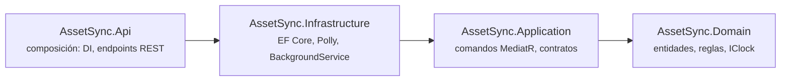
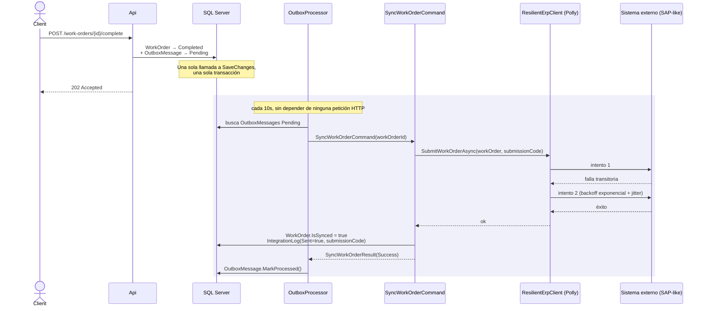

# AssetSync

[](https://github.com/aftovar123/AssetSync/actions/workflows/ci.yml)

API en C#/.NET para gestión de activos y órdenes de trabajo de mantenimiento,
con un módulo de integración hacia un sistema externo (tipo ERP/SAP) que
resuelve el mismo problema que resuelvo en producción: sincronizar datos de
forma confiable incluso cuando la red falla o el proceso se cae a mitad de
camino. Construido para demostrar Clean Architecture, CQRS con MediatR, y el
patrón Transactional Outbox — no un CRUD de ejemplo más.

## Arquitectura

```
src/
  AssetSync.Domain/         # Asset, WorkOrder, MaintenanceRecord, IntegrationLog,
                             # OutboxMessage, IClock — sin dependencias externas
  AssetSync.Application/    # Comandos y handlers (MediatR), contratos de los
                             # repositorios e integraciones que Domain no conoce
  AssetSync.Infrastructure/ # EF Core + SQL Server, el cliente ERP simulado, el
                             # servicio de notificaciones, y el BackgroundService
                             # que procesa el outbox
  AssetSync.Api/            # Composición: DI, endpoints REST, appsettings
tests/
  AssetSync.Tests/          # xUnit + Moq
```

Regla de dependencia: `Domain` no conoce nada externo. `Application` define
interfaces (`IWorkOrderRepository`, `IOutboxRepository`, `IExternalErpClient`,
`INotificationService`) que `Infrastructure` implementa. `Api` es la raíz de
composición — solo conecta piezas, no contiene lógica de negocio. Verificado
mirando las referencias reales de cada `.csproj`, no solo el nombre de la
carpeta:



Las flechas apuntan siempre hacia adentro. `Domain` no tiene ni una sola
referencia — ni de paquete ni de proyecto.

## El problema real: sincronizar sin perder nada

Cuando una orden de trabajo se completa, hay que avisarle a un sistema
externo. Eso puede fallar de formas muy distintas: la red se cae, el proceso
se reinicia a mitad de un reintento, o el sistema externo tarda y no se sabe
si procesó la solicitud o no. Este proyecto resuelve esto en dos capas:

**1. Patrón Outbox transaccional.** Al completar una orden de trabajo,
`CompleteWorkOrderCommand` marca el estado **y** encola la intención de
sincronizar en la **misma llamada a `SaveChanges`** — una sola transacción de
base de datos. El cambio de negocio y la intención de avisar al sistema
externo quedan atados: no puede pasar que uno se guarde sin el otro, ni
siquiera si el proceso se cae justo después.

**2. Reintento con backoff, separado de la lógica de negocio.** Un
`BackgroundService` revisa la tabla de outbox cada 10 segundos (sin bloquear
ninguna petición HTTP) y dispara `SyncWorkOrderCommand`, que:
- Genera un **código único por intento de sincronización**, reutilizado en
  cada reintento de ese mismo intento — así el sistema externo puede
  reconocer una solicitud repetida en vez de aplicarla dos veces.
- Llama a `IExternalErpClient` una sola vez desde el punto de vista del
  handler. Quien reintenta de verdad es `ResilientErpClient`, un decorador
  de Infraestructura que envuelve al cliente real con **Polly**: backoff
  exponencial con jitter, 3 intentos en total. "Cuántas veces y cuánto
  esperar" es una decisión de infraestructura, no algo mezclado dentro de
  la regla de negocio.
- Registra cada resultado final en `IntegrationLog` (éxito o error), y
  notifica — todo esto es el mismo patrón que uso en producción para una
  integración real con SAP, aquí aplicado a un problema propio y público.

Si la sincronización sigue fallando después de esos reintentos, el mensaje
del outbox queda pendiente con su contador de intentos — el siguiente ciclo
del `BackgroundService` lo vuelve a tomar, hasta un máximo de 5 intentos
(`OutboxMessage.MaxAttempts`). En ese punto, **`OutboxMessage` se marca a sí
mismo como `Failed`** (una regla del propio dominio, no una consulta
implícita) y deja de aparecer en el sondeo — evita reintentar para siempre
algo que claramente no va a funcionar, y queda visible para revisión manual
en vez de desaparecer en silencio.



El punto clave del diagrama: la petición HTTP termina en el primer bloque,
antes de que exista ninguna garantía de que la sincronización funcionó. Todo
lo que puede fallar — la llamada externa, sus reintentos, el resultado final
— pasa después, de forma independiente, y sobrevive a un reinicio del
proceso porque ya quedó escrito en la base de datos desde el primer paso.

## Reloj inyectable

`IClock`/`SystemClock` reemplaza las llamadas directas a `DateTime.UtcNow` en
toda la lógica de negocio — mismo patrón que uso en mi otro proyecto,
[Questlog](https://github.com/aftovar123/questlog). Permite que los tests
fijen un instante exacto (`AttemptedAt`, `CompletedAt`, `ProcessedAt`) en vez
de asumir cuándo corrió la prueba.

## Cómo correrlo

Requiere [.NET 10 SDK](https://dotnet.microsoft.com/download) y SQL Server
LocalDB (incluido en Visual Studio, o instalable aparte).

```bash
dotnet tool restore
dotnet ef database update --project src/AssetSync.Infrastructure --startup-project src/AssetSync.Api
dotnet run --project src/AssetSync.Api
```

La cadena de conexión por defecto (`appsettings.json`) apunta a
`(localdb)\MSSQLLocalDB`.

### Interfaz visual (Scalar)

Con la API corriendo en modo desarrollo, `/scalar/v1` sirve una interfaz
visual (generada a partir del documento OpenAPI que expone `/openapi/v1.json`)
para explorar y probar cada endpoint sin Postman ni curl: request/response de
ejemplo, esquemas de cada modelo, y un botón para ejecutar la llamada real
contra la API que está corriendo.

```
http://localhost:5188/scalar/v1
```

Estas son capturas reales de un ciclo completo corriendo: se crea una orden de
trabajo, se marca como completada (`POST /work-orders/{id}/complete`), y unos
segundos después el `OutboxProcessor` ya la sincronizó — sin ninguna llamada
manual entre medio.

| Interfaz visual (Scalar) | Outbox después de sincronizar |
|---|---|
|  |  |

**Órdenes de trabajo ya sincronizadas** — mismo endpoint (`GET /work-orders`) visto en vivo: cada orden completada aparece con `isSynced: true`.


### Endpoints principales

| Método | Ruta | Qué hace |
|---|---|---|
| `POST` | `/assets` | Crea un activo |
| `POST` | `/work-orders` | Crea una orden de trabajo |
| `POST` | `/work-orders/{id}/complete` | Marca completada y encola la sincronización (202 inmediato) |
| `GET` | `/work-orders/{id}/integration-logs` | Historial de intentos de sincronización |
| `GET` | `/outbox` | Estado de la cola de sincronización pendiente |

## Tests

```bash
dotnet test
```

13 tests con xUnit y Moq — sin tocar la base de datos real ni el reloj del
sistema, y sin esperar tiempo real salvo donde se prueba backoff de verdad:

- `SyncWorkOrderCommandHandler`: éxito directo, que una orden ya sincronizada
  no se reenvía, y que un fallo del cliente ERP se registra y notifica.
- `ResilientErpClient`: que el decorador de Polly sí reintenta ante fallos
  transitorios (con el mismo código de idempotencia en cada intento) hasta
  lograr éxito, y que ante fallos permanentes reintenta las veces
  configuradas y finalmente se rinde.
- `CompleteWorkOrderCommandHandler`: que el cambio de estado y el mensaje de
  outbox se guardan en una sola llamada a `SaveChanges` — la garantía de
  atomicidad del patrón.
- `ProcessOutboxCommandHandler`: que un mensaje procesado con éxito se marca
  como tal, que uno fallido registra el intento sin marcarlo procesado, y
  que sin mensajes pendientes no se llama al sistema externo.
- `OutboxMessage` (dominio puro, sin mocks): que un mensaje se queda
  `Pending` mientras no llegue al máximo de intentos, y que al llegar pasa a
  `Failed` — la regla vive en la entidad, no en una consulta de la capa de
  persistencia.

## Decisiones fuera de alcance (a propósito)

- El cliente ERP y el servicio de notificaciones son simulados
  (`SimulatedErpClient`, `ConsoleNotificationService`) para que el proyecto
  corra sin credenciales externas — en producción serían una llamada
  HTTP/SOAP real y un envío de correo real, respectivamente, detrás de la
  misma interfaz.
- Sin autenticación ni autorización — no es el foco de este proyecto.
- El outbox está acoplado a `WorkOrder` en vez de ser genérico para
  cualquier tipo de evento; una versión más general guardaría un tipo de
  mensaje y un payload serializado.
