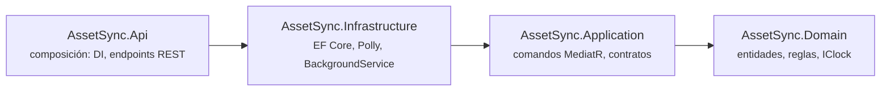
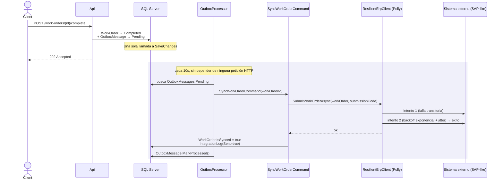
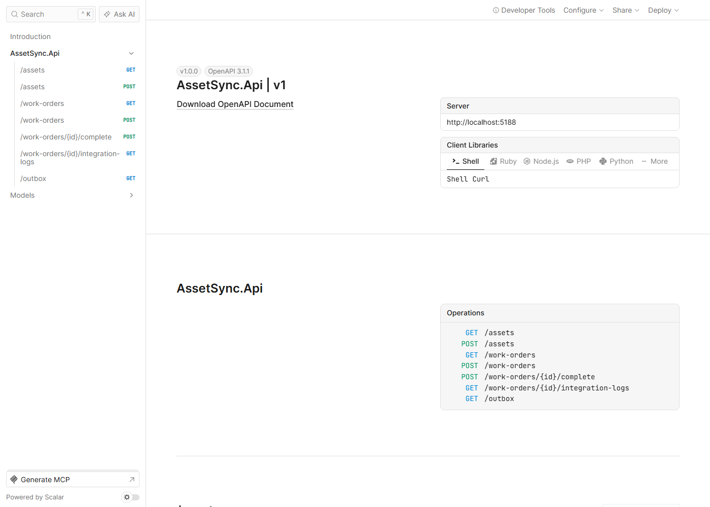
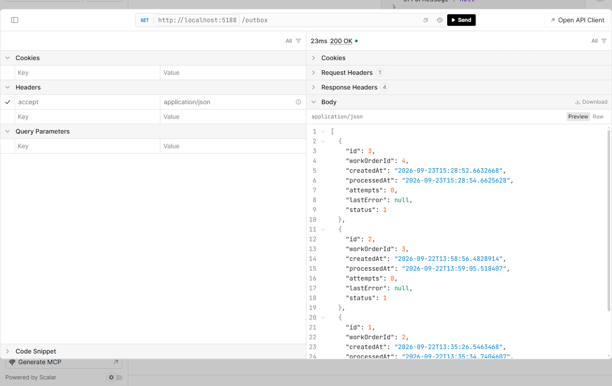
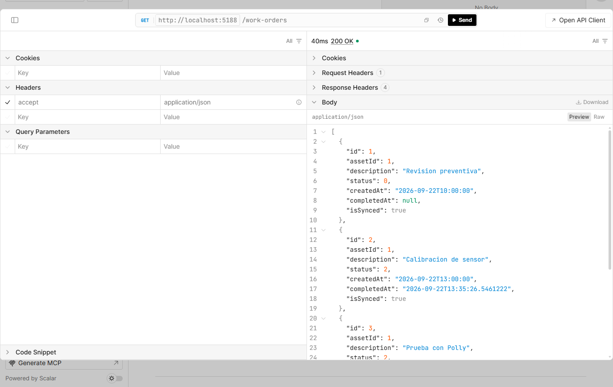

# AssetSync

[](https://github.com/aftovar123/AssetSync/actions/workflows/ci.yml)

API en C#/.NET para gestión de activos y órdenes de trabajo de mantenimiento,
con un módulo de integración hacia un sistema externo (tipo ERP/SAP) que
resuelve el mismo problema que resuelvo en producción: sincronizar datos de
forma confiable incluso cuando la red falla o el proceso se cae a mitad de
camino. Construido para demostrar Clean Architecture, CQRS con MediatR, y el
patrón Transactional Outbox — no un CRUD de ejemplo más.

## Despliegue en producción (Azure)

Corre en vivo en Azure App Service (Linux, .NET 10) conectado a Azure SQL
Database, con CI/CD real desde GitHub Actions: cada push a `main` compila,
publica y despliega automáticamente, sin pasos manuales.

**Health check en vivo:** https://assetsync-api-andres-g5etgpdsc2hfccd6.westus3-01.azurewebsites.net/health

Corre en el nivel gratuito de Azure (App Service F1 + SQL Database
serverless), así que la primera petición tras un rato de inactividad puede
tardar unos segundos extra mientras el App Service y la base de datos
"despiertan" — comportamiento esperado de ese nivel, no un error. La
interfaz de Scalar solo está habilitada en desarrollo (buena práctica: no se
expone documentación interactiva de la API en un entorno público).

## Arquitectura

```
src/
  AssetSync.Domain/         # Entidades y reglas — sin dependencias externas
  AssetSync.Application/    # Comandos y handlers (MediatR), contratos que
                             # Domain no conoce (repositorios, integraciones)
  AssetSync.Infrastructure/ # EF Core + SQL Server, cliente ERP simulado,
                             # BackgroundService que procesa el outbox
  AssetSync.Api/            # Composición: DI, endpoints REST
tests/
  AssetSync.Tests/          # xUnit + Moq
```



Las flechas apuntan siempre hacia adentro — verificado mirando las
referencias reales de cada `.csproj`, no solo el nombre de la carpeta.
`Domain` no tiene ni una sola referencia, ni de paquete ni de proyecto.

## El problema real: sincronizar sin perder nada

Al completar una orden de trabajo hay que avisarle a un sistema externo, y
eso puede fallar de formas muy distintas: la red se cae, el proceso se
reinicia a mitad de un reintento, o no se sabe si la solicitud llegó. Dos
capas resuelven esto:

1. **Outbox transaccional.** `CompleteWorkOrderCommand` marca el estado **y**
   encola la intención de sincronizar en la misma llamada a `SaveChanges` —
   una sola transacción. No puede pasar que uno se guarde sin el otro.
2. **Reintento con backoff, separado del negocio.** Un `BackgroundService`
   revisa el outbox cada 10s y dispara `SyncWorkOrderCommand`, que genera un
   **código de idempotencia** reutilizado en cada reintento, llama a
   `IExternalErpClient` una sola vez desde su punto de vista (quien reintenta
   de verdad es `ResilientErpClient`, un decorador con **Polly**: backoff
   exponencial + jitter), y registra cada resultado en `IntegrationLog`.

Si el mensaje sigue fallando tras 5 intentos, `OutboxMessage` se marca a sí
mismo como `Failed` — una regla del dominio, no una consulta implícita — y
deja de reintentarse para siempre.

**Claim atómico.** Tomar el mensaje pendiente y reintentarlo son dos pasos
distintos: si dos instancias de `OutboxProcessor` corrieran a la vez, un
simple `SELECT` seguido de un `UPDATE` dejaría una ventana donde ambas
podrían tomar el mismo mensaje y sincronizarlo dos veces. `ClaimPendingAsync`
lo resuelve con un solo `UPDATE ... OUTPUT` — atómico en SQL Server — que
mueve el mensaje a `Processing` y lo devuelve en la misma sentencia. Un
mensaje que quedó en `Processing` más de 2 minutos (su instancia se cayó a
mitad del proceso) vuelve a estar disponible para reclamarse, en vez de
perderse para siempre.



La petición HTTP termina en el primer bloque, antes de que exista ninguna
garantía de sincronización. Todo lo que puede fallar pasa después, de forma
independiente, y sobrevive a un reinicio porque ya quedó en la base de datos.

## Validación y manejo de errores

`POST /assets` y `POST /work-orders` pasan por comandos MediatR
(`CreateAssetCommand`, `CreateWorkOrderCommand`), igual que el resto de
`Application`. Un `ValidationBehavior<TRequest, TResponse>` — un pipeline
behavior de MediatR registrado una sola vez — corre todos los
`IValidator<TRequest>` de FluentValidation **antes** de cualquier handler:
si algo falla, lanza `ValidationException` y el handler nunca se ejecuta. La
regla de `AssetId` en `CreateWorkOrderCommandValidator` es un `MustAsync` que
consulta `IAssetRepository` de verdad — no solo "¿es mayor que cero?", sino
"¿ese activo existe?".

Un `GlobalExceptionHandler` (`IExceptionHandler`, .NET 8+) traduce eso a
respuestas HTTP: `ValidationException` → `400` con el detalle por campo,
`NotFoundException` → `404`, cualquier otra excepción → `500` genérico sin
filtrar detalles internos. Ejemplos reales contra la API corriendo:

```bash
$ curl -X POST http://localhost:5188/work-orders -d '{"assetId":9999,"description":""}'
{"errors":{"AssetId":["Asset 9999 does not exist."],"Description":["'Description' no debería estar vacío."]}}
# HTTP 400

$ curl -X POST http://localhost:5188/work-orders/99999/complete
{"title":"Work order 99999 not found.","status":404}
```

## Reloj inyectable

`IClock`/`SystemClock` reemplaza `DateTime.UtcNow` en toda la lógica de
negocio — mismo patrón que uso en [Questlog](https://github.com/aftovar123/questlog).
Permite que los tests fijen un instante exacto en vez de asumir cuándo corrió la prueba.

## Cómo correrlo

Requiere [.NET 10 SDK](https://dotnet.microsoft.com/download) y SQL Server
LocalDB (incluido en Visual Studio, o instalable aparte).

```bash
dotnet tool restore
dotnet ef database update --project src/AssetSync.Infrastructure --startup-project src/AssetSync.Api
dotnet run --project src/AssetSync.Api
```

La cadena de conexión por defecto (`appsettings.json`) apunta a `(localdb)\MSSQLLocalDB`.

### Docker

```bash
docker build -t assetsync-api .
docker run -p 8080:8080 -e ConnectionStrings__AssetSyncDb="<tu cadena de SQL Server>" assetsync-api
```

`LocalDB` es exclusivo de Windows y no corre dentro de un contenedor Linux, así
que hay que apuntar `ConnectionStrings__AssetSyncDb` a un SQL Server real
(local, en otro contenedor, o en la nube). El Dockerfile se construye y se
valida en cada push mediante GitHub Actions — no hace falta tener Docker
instalado localmente para trabajar en el proyecto día a día.

### Interfaz visual (Scalar)

En desarrollo, `/scalar/v1` sirve una interfaz visual (generada desde
`/openapi/v1.json`) para explorar y probar cada endpoint sin Postman ni curl.

Capturas reales de un ciclo completo: se crea una orden, se completa, y
segundos después el `OutboxProcessor` ya la sincronizó.

| Interfaz visual (Scalar) | Outbox después de sincronizar |
|---|---|
|  |  |



### Health checks

`GET /health` no solo confirma que el proceso está vivo: incluye un check de
`SQL Server` (`CanConnectAsync`) y uno propio del dominio, `outbox`, que se
pone en `Degraded` si algún mensaje llegó a `Failed` (agotó sus reintentos) —
algo que un simple ping a la base de datos nunca revelaría.

```json
{"status":"Healthy","checks":[
  {"name":"database","status":"Healthy","description":"SQL Server reachable."},
  {"name":"outbox","status":"Healthy","description":"No dead-lettered outbox messages."}
]}
```

### Rate limiting

Cada endpoint (salvo `/health`, que Azure y las herramientas de monitoreo
necesitan llamar sin restricción) aplica un límite de **60 peticiones por
minuto por dirección IP**, con ventana fija y sin cola: al superar el límite,
la petición 61 en adelante recibe `429 Too Many Requests` de inmediato, sin
encolarse ni consumir hilos del plan gratuito de App Service. Verificado en
vivo: 60 peticiones seguidas a `/assets` devuelven `200`, la 61 en adelante
devuelve `429`, y `/health` sigue respondiendo `200` durante todo el proceso.

### Logging estructurado (Serilog)

Reemplaza el logger por defecto de ASP.NET Core — configurado por completo
desde `appsettings.json` (nivel mínimo, sinks, overrides por namespace), no
hardcodeado en `Program.cs`. Dos sinks activos: consola y un archivo rotado
por día (`logs/assetsync-YYYYMMDD.log`, se conservan 14 días). Todo lo que
ya usaba `ILogger<T>` — los reintentos de `ResilientErpClient`, el
`GlobalExceptionHandler`, el `OutboxProcessor` — pasó a fluir por Serilog sin
tocar una sola línea de esos archivos, más `UseSerilogRequestLogging()` para
una línea estructurada por request (método, ruta, código, duración):

```
[08:44:36 INF] HTTP GET /assets responded 200 in 496.8430 ms
[08:44:59 INF] Outbox processor handled 1 pending message(s).
```

### Endpoints principales

| Método | Ruta | Qué hace |
|---|---|---|
| `GET` | `/health` | Estado de la API, la base de datos y el outbox |
| `POST` | `/assets` | Crea un activo |
| `POST` | `/work-orders` | Crea una orden de trabajo |
| `POST` | `/work-orders/{id}/complete` | Marca completada y encola la sincronización (202 inmediato) |
| `GET` | `/work-orders/{id}/integration-logs` | Historial de intentos de sincronización |
| `GET` | `/outbox` | Estado de la cola de sincronización pendiente |

## Tests

```bash
dotnet test
```

35 tests con xUnit y Moq — sin base de datos real, sin reloj del sistema, y
sin esperar tiempo real salvo donde se prueba backoff de verdad:

- **Outbox y sincronización**: `SyncWorkOrderCommandHandler`,
  `CompleteWorkOrderCommandHandler`, `ProcessOutboxCommandHandler` y
  `OutboxMessage` (dominio puro) — éxito, duplicados, fallos, la regla de
  `Failed` tras el máximo de intentos, y que un reintento fallido pero por
  debajo del máximo vuelve a `Pending` (no se queda atascado en `Processing`).
- **Resiliencia**: `ResilientErpClient` reintenta ante fallos transitorios
  con el mismo código de idempotencia, y se rinde tras los intentos configurados.
- **Validación y errores**: `ValidationBehavior`, los validadores de
  `CreateAssetCommand`/`CreateWorkOrderCommand` (incluyendo el `AssetId`
  async contra un repositorio mockeado), y `GlobalExceptionHandler`
  (400/404/500 según el tipo de excepción).
- **Comandos de creación**: que los handlers persisten la entidad correcta
  usando el reloj inyectado, no `DateTime.UtcNow` directo.
- **Health checks**: `outbox` pasa a `Degraded` con mensajes `Failed` y se
  mantiene `Healthy` sin ellos (EF Core InMemory, sin SQL Server real).

## Decisiones fuera de alcance (a propósito)

- El cliente ERP y el servicio de notificaciones son simulados para que el
  proyecto corra sin credenciales externas.
- Sin autenticación ni autorización — no es el foco de este proyecto.
- El outbox está acoplado a `WorkOrder` en vez de ser genérico para
  cualquier tipo de evento.
- El mapa de errores cubre validación y "no encontrado"; excepciones de
  negocio más específicas (conflictos, reglas de estado) seguirían cayendo
  al `500` genérico hasta que el proyecto las necesite.
