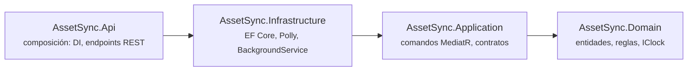
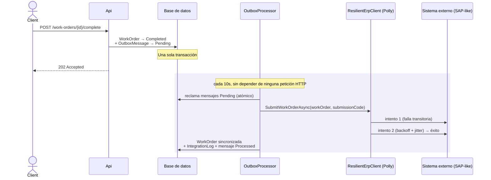

# AssetSync

[](https://github.com/aftovar123/AssetSync/actions/workflows/ci.yml)

API en C#/.NET 10 para gestión de activos y órdenes de trabajo de
mantenimiento, con un módulo de integración hacia un sistema externo (tipo
ERP/SAP) que resuelve el mismo problema que resuelvo en producción:
sincronizar datos de forma confiable incluso cuando la red falla o el proceso
se cae a mitad de camino. No es un CRUD de ejemplo más.

**En vivo en Azure:** [health check](https://assetsync-api-andres-g5etgpdsc2hfccd6.westus3-01.azurewebsites.net/health)
— corre en el nivel gratuito, así que la primera petición tras un rato de
inactividad puede tardar unos segundos mientras la base de datos despierta.

## Qué demuestra

| Área | Cómo | Detalle |
|---|---|---|
| Arquitectura | Clean Architecture, CQRS con MediatR, validación con FluentValidation en un pipeline behavior | [Diseño](docs/design.md) |
| Sincronización confiable | Transactional Outbox, claim atómico entre procesos, idempotencia, reintentos con Polly | [Diseño](docs/design.md#outbox-transaccional-y-reintentos) |
| Eventos | Publicación a RabbitMQ *best-effort* y consumidor en segundo plano | [Diseño](docs/design.md#eventos-con-rabbitmq) |
| Datos | EF Core con **SQL Server y PostgreSQL**, reintentos ante fallos transitorios, sin N+1, paginación | [Diseño](docs/design.md#acceso-a-datos) |
| Seguridad | OAuth2 client credentials, JWT con un scope por área, rate limiting | [Autenticación](docs/authentication.md) |
| Observabilidad | OpenTelemetry → Application Insights, trazas y métricas propias, Serilog | [Observabilidad](docs/observability.md) |
| Infraestructura | Azure App Service + Azure SQL descritos con **Bicep**, despliegue por OIDC sin secretos | [Infraestructura](docs/infrastructure.md) |
| Pruebas y CI/CD | 125 tests; integración con Testcontainers contra los dos motores en cada push | [Pruebas](docs/testing.md) |

## Arquitectura

```
src/
  AssetSync.Domain/                # Entidades y reglas, sin dependencias externas
  AssetSync.Application/           # Comandos y handlers (MediatR), contratos
  AssetSync.Infrastructure/        # EF Core, cliente ERP con Polly, procesador del outbox
  AssetSync.Migrations.PostgreSql/ # Migraciones de EF Core para PostgreSQL
  AssetSync.Api/                   # Composición: DI, endpoints REST, auth, telemetría
tests/
  AssetSync.Tests/                 # Unitarias: xUnit + Moq
  AssetSync.IntegrationTests/      # La API real contra SQL Server y PostgreSQL en Docker
infra/                             # Bicep: toda la infraestructura de Azure
```


```mermaid
flowchart LR
    Api["AssetSync.Api<br/><small>composición: DI, endpoints REST</small>"] --> Infra
    Infra["AssetSync.Infrastructure<br/><small>EF Core, Polly, BackgroundService</small>"] --> App
    App["AssetSync.Application<br/><small>comandos MediatR, contratos</small>"] --> Dom
    Dom["AssetSync.Domain<br/><small>entidades, reglas, IClock</small>"]
```

Las dependencias apuntan siempre hacia adentro: `Domain` no tiene ninguna
referencia, ni de paquete ni de proyecto.

## El problema real: sincronizar sin perder nada

Al completar una orden de trabajo hay que avisarle a un sistema externo, y
eso puede fallar: la red se cae, el proceso se reinicia a mitad de un
reintento, o no se sabe si la solicitud llegó.

1. **Outbox transaccional.** Completar la orden y encolar la sincronización
   se guardan en la misma transacción: no puede pasar que uno se guarde sin
   el otro.
2. **Reintentos separados del negocio.** Un `BackgroundService` procesa el
   outbox cada 10 segundos. Cada envío lleva un **código de idempotencia**
   que se reutiliza en los reintentos (backoff exponencial con Polly), y cada
   intento queda registrado. Tras 5 fallos, el mensaje queda en `Failed`.
3. **Claim atómico.** Dos procesos nunca toman el mismo mensaje: una sola
   sentencia lo reclama y lo devuelve (`UPDATE TOP ... OUTPUT` en SQL Server,
   `FOR UPDATE SKIP LOCKED` en PostgreSQL), probado con dos procesos en
   paralelo contra bases reales.


```mermaid
sequenceDiagram
    actor Client
    participant Api
    participant DB as Base de datos
    participant Processor as OutboxProcessor
    participant Erp as ResilientErpClient (Polly)
    participant Ext as Sistema externo (SAP-like)

    Client->>Api: POST /work-orders/{id}/complete
    Api->>DB: WorkOrder → Completed<br/>+ OutboxMessage → Pending
    Note over DB: Una sola transacción
    Api-->>Client: 202 Accepted

    rect rgb(240, 240, 250)
    Note over Processor: cada 10s, sin depender de ninguna petición HTTP
    Processor->>DB: reclama mensajes Pending (atómico)
    Processor->>Erp: SubmitWorkOrderAsync(workOrder, submissionCode)
    Erp->>Ext: intento 1 (falla transitoria)
    Erp->>Ext: intento 2 (backoff + jitter) → éxito
    Processor->>DB: WorkOrder sincronizada<br/>+ IntegrationLog + mensaje Processed
    end
```

La petición HTTP termina en el primer bloque. Todo lo que puede fallar pasa
después, de forma independiente, y sobrevive a un reinicio porque ya quedó en
la base de datos. Más detalle en [Diseño](docs/design.md).

## Cómo correrlo

Requiere [.NET 10 SDK](https://dotnet.microsoft.com/download), una base de
datos (SQL Server o PostgreSQL) y una clave de firma JWT; los pasos completos
para Windows, macOS, PostgreSQL y Docker están en
[Desarrollo local](docs/local-development.md).

```bash
dotnet tool restore
dotnet ef database update --project src/AssetSync.Infrastructure --startup-project src/AssetSync.Api
dotnet run --project src/AssetSync.Api   # interfaz de Scalar en /scalar/v1
```

## Endpoints

| Método | Ruta | Qué hace | Scope requerido |
|---|---|---|---|
| `GET` | `/health` | Estado de la API, la base de datos, el outbox y la mensajería | No |
| `POST` | `/auth/token` | Emite un JWT (OAuth2 client credentials) | No |
| `GET` | `/assets` | Lista los activos (paginado) | No |
| `POST` | `/assets` | Crea un activo | `assets.write` |
| `GET` | `/work-orders` | Lista las órdenes de trabajo (paginado) | No |
| `POST` | `/work-orders` | Crea una orden de trabajo | `workorders.write` |
| `POST` | `/work-orders/{id}/complete` | Marca completada y encola la sincronización (202 inmediato) | `workorders.write` |
| `GET` | `/work-orders/{id}/integration-logs` | Historial de intentos de sincronización (paginado) | `integration.read` |
| `GET` | `/outbox` | Estado de la cola de sincronización (paginado) | `integration.read` |

## Pruebas

```bash
dotnet test tests/AssetSync.Tests             # unitarias, en un segundo y sin Docker
dotnet test tests/AssetSync.IntegrationTests  # integración contra SQL Server (necesita Docker)
ASSETSYNC_TEST_DATABASE=PostgreSql dotnet test tests/AssetSync.IntegrationTests  # contra PostgreSQL
```

96 unitarias y 29 de integración que levantan la API completa contra bases
de datos reales en Docker. En GitHub Actions corren en cada push, las de
integración contra los dos motores. Ver [Pruebas](docs/testing.md).

## Decisiones fuera de alcance (a propósito)

- El cliente ERP y el servicio de notificaciones son simulados para que el
  proyecto corra sin credenciales externas.
- Los clientes se configuran en la propia API, que también emite los tokens,
  sin refresh tokens ni un proveedor de identidad externo (Entra ID, Auth0):
  suficiente para demostrar el flujo client credentials de punta a punta sin
  depender de un servicio de pago.
- El outbox está acoplado a `WorkOrder` en vez de ser genérico para
  cualquier tipo de evento.
- El mapa de errores cubre validación y "no encontrado"; excepciones de
  negocio más específicas (conflictos, reglas de estado) seguirían cayendo
  al `500` genérico hasta que el proyecto las necesite.

## Licencia

© 2026 Andrés Tovar Sandoval. Todos los derechos reservados. El código se publica solo como portafolio, para consulta y evaluación; no se permite copiarlo, modificarlo, redistribuirlo ni usarlo sin autorización escrita del autor. Ver [LICENSE](LICENSE).
