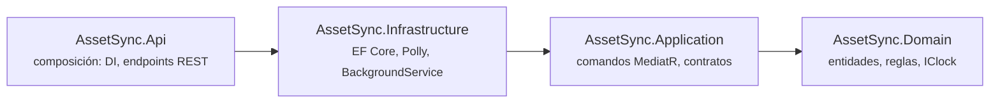
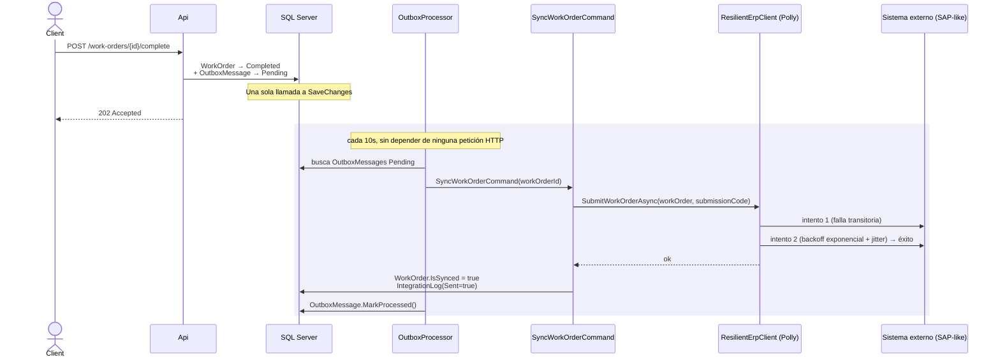

# AssetSync

[](https://github.com/aftovar123/AssetSync/actions/workflows/ci.yml)

API en C#/.NET para gestión de activos y órdenes de trabajo de mantenimiento,
con un módulo de integración hacia un sistema externo (tipo ERP/SAP) que
resuelve el mismo problema que resuelvo en producción: sincronizar datos de
forma confiable incluso cuando la red falla o el proceso se cae a mitad de
camino. Construido para demostrar Clean Architecture, CQRS con MediatR, y el
patrón Transactional Outbox — no un CRUD de ejemplo más.

## Despliegue en producción (Azure)

Corre en vivo en Azure App Service (Linux, .NET 10) conectado a Azure SQL
Database, con CI/CD real desde GitHub Actions: cada push a `main` compila,
publica y despliega automáticamente, sin pasos manuales.

**Health check en vivo:** https://assetsync-api-andres-g5etgpdsc2hfccd6.westus3-01.azurewebsites.net/health

Corre en el nivel gratuito de Azure (App Service F1 + SQL Database
serverless), así que la primera petición tras un rato de inactividad puede
tardar unos segundos extra mientras el App Service y la base de datos
"despiertan" — comportamiento esperado de ese nivel, no un error. La
interfaz de Scalar solo está habilitada en desarrollo (buena práctica: no se
expone documentación interactiva de la API en un entorno público).

## Arquitectura

```
src/
  AssetSync.Domain/         # Entidades y reglas — sin dependencias externas
  AssetSync.Application/    # Comandos y handlers (MediatR), contratos que
                             # Domain no conoce (repositorios, integraciones)
  AssetSync.Infrastructure/ # EF Core + SQL Server, cliente ERP simulado,
                             # BackgroundService que procesa el outbox
  AssetSync.Api/            # Composición: DI, endpoints REST
tests/
  AssetSync.Tests/          # xUnit + Moq
```


```mermaid
flowchart LR
    Api["AssetSync.Api<br/><small>composición: DI, endpoints REST</small>"] --> Infra
    Infra["AssetSync.Infrastructure<br/><small>EF Core, Polly, BackgroundService</small>"] --> App
    App["AssetSync.Application<br/><small>comandos MediatR, contratos</small>"] --> Dom
    Dom["AssetSync.Domain<br/><small>entidades, reglas, IClock</small>"]
```

Las flechas apuntan siempre hacia adentro — verificado mirando las
referencias reales de cada `.csproj`, no solo el nombre de la carpeta.
`Domain` no tiene ni una sola referencia, ni de paquete ni de proyecto.

## El problema real: sincronizar sin perder nada

Al completar una orden de trabajo hay que avisarle a un sistema externo, y
eso puede fallar de formas muy distintas: la red se cae, el proceso se
reinicia a mitad de un reintento, o no se sabe si la solicitud llegó. Dos
capas resuelven esto:

1. **Outbox transaccional.** `CompleteWorkOrderCommand` marca el estado **y**
   encola la intención de sincronizar en la misma llamada a `SaveChanges` —
   una sola transacción. No puede pasar que uno se guarde sin el otro.
2. **Reintento con backoff, separado del negocio.** Un `BackgroundService`
   revisa el outbox cada 10s y dispara `SyncWorkOrderCommand`, que genera un
   **código de idempotencia** reutilizado en cada reintento, llama a
   `IExternalErpClient` una sola vez desde su punto de vista (quien reintenta
   de verdad es `ResilientErpClient`, un decorador con **Polly**: backoff
   exponencial + jitter), y registra cada resultado en `IntegrationLog`.

Si el mensaje sigue fallando tras 5 intentos, `OutboxMessage` se marca a sí
mismo como `Failed` — una regla del dominio, no una consulta implícita — y
deja de reintentarse para siempre.

**Claim atómico.** Tomar el mensaje pendiente y reintentarlo son dos pasos
distintos: si dos instancias de `OutboxProcessor` corrieran a la vez, un
simple `SELECT` seguido de un `UPDATE` dejaría una ventana donde ambas
podrían tomar el mismo mensaje y sincronizarlo dos veces. `ClaimPendingAsync`
lo resuelve con un solo `UPDATE ... OUTPUT` — atómico en SQL Server — que
mueve el mensaje a `Processing` y lo devuelve en la misma sentencia. Un
mensaje que quedó en `Processing` más de 2 minutos (su instancia se cayó a
mitad del proceso) vuelve a estar disponible para reclamarse, en vez de
perderse para siempre.


```mermaid
sequenceDiagram
    actor Client
    participant Api
    participant DB as SQL Server
    participant Processor as OutboxProcessor
    participant Sync as SyncWorkOrderCommand
    participant Erp as ResilientErpClient (Polly)
    participant Ext as Sistema externo (SAP-like)

    Client->>Api: POST /work-orders/{id}/complete
    Api->>DB: WorkOrder → Completed<br/>+ OutboxMessage → Pending
    Note over DB: Una sola llamada a SaveChanges
    Api-->>Client: 202 Accepted

    rect rgb(240, 240, 250)
    Note over Processor: cada 10s, sin depender de ninguna petición HTTP
    Processor->>DB: busca OutboxMessages Pending
    Processor->>Sync: SyncWorkOrderCommand(workOrderId)
    Sync->>Erp: SubmitWorkOrderAsync(workOrder, submissionCode)
    Erp->>Ext: intento 1 (falla transitoria)
    Erp->>Ext: intento 2 (backoff exponencial + jitter) → éxito
    Erp-->>Sync: ok
    Sync->>DB: WorkOrder.IsSynced = true<br/>IntegrationLog(Sent=true)
    Processor->>DB: OutboxMessage.MarkProcessed()
    end
```

La petición HTTP termina en el primer bloque, antes de que exista ninguna
garantía de sincronización. Todo lo que puede fallar pasa después, de forma
independiente, y sobrevive a un reinicio porque ya quedó en la base de datos.

## Validación y manejo de errores

`POST /assets` y `POST /work-orders` pasan por comandos MediatR
(`CreateAssetCommand`, `CreateWorkOrderCommand`), igual que el resto de
`Application`. Un `ValidationBehavior<TRequest, TResponse>` — un pipeline
behavior de MediatR registrado una sola vez — corre todos los
`IValidator<TRequest>` de FluentValidation **antes** de cualquier handler:
si algo falla, lanza `ValidationException` y el handler nunca se ejecuta. La
regla de `AssetId` en `CreateWorkOrderCommandValidator` es un `MustAsync` que
consulta `IAssetRepository` de verdad — no solo "¿es mayor que cero?", sino
"¿ese activo existe?".

Un `GlobalExceptionHandler` (`IExceptionHandler`, .NET 8+) traduce eso a
respuestas HTTP: `ValidationException` → `400` con el detalle por campo,
`NotFoundException` → `404`, cualquier otra excepción → `500` genérico sin
filtrar detalles internos. Ejemplos reales contra la API corriendo:

```bash
$ curl -X POST http://localhost:5188/work-orders -d '{"assetId":9999,"description":""}'
{"errors":{"AssetId":["Asset 9999 does not exist."],"Description":["'Description' no debería estar vacío."]}}
# HTTP 400

$ curl -X POST http://localhost:5188/work-orders/99999/complete
{"title":"Work order 99999 not found.","status":404}
```

## Reloj inyectable

`IClock`/`SystemClock` reemplaza `DateTime.UtcNow` en toda la lógica de
negocio — mismo patrón que uso en [Questlog](https://github.com/aftovar123/questlog).
Permite que los tests fijen un instante exacto en vez de asumir cuándo corrió la prueba.

## Cómo correrlo

Requiere [.NET 10 SDK](https://dotnet.microsoft.com/download) y SQL Server
LocalDB (incluido en Visual Studio, o instalable aparte).

```bash
dotnet tool restore
dotnet ef database update --project src/AssetSync.Infrastructure --startup-project src/AssetSync.Api
dotnet run --project src/AssetSync.Api
```

La cadena de conexión por defecto (`appsettings.json`) apunta a `(localdb)\MSSQLLocalDB`.

LocalDB es exclusivo de Windows. En macOS o Linux, SQL Server corre en un
contenedor (en Apple Silicon, con la emulación de Rosetta activada en
Docker), expuesto solo en `127.0.0.1`, y la cadena se sobrescribe con
user-secrets:

```bash
docker run -d --name assetsync-sql -e ACCEPT_EULA=Y -e MSSQL_PID=Developer \
  -e MSSQL_SA_PASSWORD="<contraseña fuerte>" -p 127.0.0.1:1433:1433 \
  -v assetsync-sql-data:/var/opt/mssql mcr.microsoft.com/mssql/server:2022-latest
dotnet user-secrets set "ConnectionStrings:AssetSyncDb" \
  "Server=127.0.0.1,1433;Database=AssetSyncDb;User Id=sa;Password=<contraseña>;TrustServerCertificate=True" \
  --project src/AssetSync.Api
```

RabbitMQ es opcional en desarrollo: sin configurar, la API corre igual —
`messaging` simplemente aparece `Degraded` en `/health` (ver sección de
arquitectura orientada a eventos). Para probarlo localmente, con
[User Secrets](https://learn.microsoft.com/aspnet/core/security/app-secrets):

```bash
dotnet user-secrets set "RabbitMq:ConnectionString" "<tu AMQP URL>" --project src/AssetSync.Api
```

La autenticación JWT, en cambio, **sí es obligatoria**: sin clave de firma
la API se niega a arrancar (ver sección de autenticación). Para desarrollo:

```bash
dotnet user-secrets set "Jwt:SigningKey" "$(openssl rand -base64 48)" --project src/AssetSync.Api
dotnet user-secrets set "Auth:Clients:0:ClientId" "erp-integration" --project src/AssetSync.Api
dotnet user-secrets set "Auth:Clients:0:ClientSecret" "<un secreto largo>" --project src/AssetSync.Api
dotnet user-secrets set "Auth:Clients:0:Scopes" "workorders.write integration.read" --project src/AssetSync.Api
dotnet user-secrets set "Auth:Clients:1:ClientId" "asset-admin" --project src/AssetSync.Api
dotnet user-secrets set "Auth:Clients:1:ClientSecret" "<otro secreto largo>" --project src/AssetSync.Api
dotnet user-secrets set "Auth:Clients:1:Scopes" "assets.write" --project src/AssetSync.Api
```

### Docker

```bash
docker build -t assetsync-api .
docker run -p 8080:8080 \
  -e ConnectionStrings__AssetSyncDb="<tu cadena de SQL Server>" \
  -e RabbitMq__ConnectionString="<tu AMQP URL>" \
  -e Jwt__SigningKey="<clave de 32+ bytes>" \
  -e Auth__Clients__0__ClientId="erp-integration" -e Auth__Clients__0__ClientSecret="<secreto>" \
  -e Auth__Clients__0__Scopes="workorders.write integration.read" \
  assetsync-api
```

`LocalDB` es exclusivo de Windows y no corre dentro de un contenedor Linux, así
que hay que apuntar `ConnectionStrings__AssetSyncDb` a un SQL Server real
(local, en otro contenedor, o en la nube). El Dockerfile se construye y se
valida en cada push mediante GitHub Actions — no hace falta tener Docker
instalado localmente para trabajar en el proyecto día a día.

### Interfaz visual (Scalar)

En desarrollo, `/scalar/v1` sirve una interfaz visual (generada desde
`/openapi/v1.json`) para explorar y probar cada endpoint sin Postman ni curl.

Capturas reales de un ciclo completo: se crea una orden, se completa, y
segundos después el `OutboxProcessor` ya la sincronizó.

| Interfaz visual (Scalar) | Outbox después de sincronizar |
|---|---|
|  |  |


### Health checks

`GET /health` no solo confirma que el proceso está vivo: incluye un check de
`SQL Server` (`CanConnectAsync`) y uno propio del dominio, `outbox`, que se
pone en `Degraded` si algún mensaje llegó a `Failed` (agotó sus reintentos) —
algo que un simple ping a la base de datos nunca revelaría.

```json
{"status":"Healthy","checks":[
  {"name":"database","status":"Healthy","description":"SQL Server reachable."},
  {"name":"outbox","status":"Healthy","description":"No dead-lettered outbox messages."}
]}
```

### Arquitectura orientada a eventos (RabbitMQ)

Cuando `SyncWorkOrderCommandHandler` sincroniza una orden de trabajo con
éxito, publica un `WorkOrderSyncedEvent` a una cola de RabbitMQ (probado
contra una instancia gratuita de [CloudAMQP](https://www.cloudamqp.com/),
sobre LavinMQ — mismo protocolo AMQP 0.9.1, mismo cliente .NET) — separado
tanto de `IExternalErpClient` (que habla con el sistema externo) como de
`INotificationService` (que avisa a una persona). Otros sistemas
(reportes, analítica, servicios corriente abajo) pueden suscribirse sin
tener que sondear la base de datos ni el ERP.

Es **best-effort a propósito**: si el broker de mensajería falla o no está
configurado, `RabbitMqEventPublisher` registra una advertencia y continúa
— nunca hace que se reporte como fallida una sincronización con el ERP que
en realidad sí tuvo éxito. Por la misma razón, el health check de
`messaging` responde `Degraded` (no `Unhealthy`) cuando el broker no está
disponible, para no tumbar todo `/health` a `503` por un problema en una
función complementaria.

`WorkOrderSyncedConsumer` (un `BackgroundService` más, mismo patrón que
`OutboxProcessor`) se suscribe a esa misma cola dentro del propio proceso —
arquitectónicamente idéntico a un servicio separado — y confirma que el
evento efectivamente se recibió. Verificado en vivo contra una instancia
real: se crea una orden, se completa, y segundos después el log muestra
`WorkOrderSyncedEvent received: work order 9, submission ..., synced at ...`.

### Rate limiting

Cada endpoint (salvo `/health`, que Azure y las herramientas de monitoreo
necesitan llamar sin restricción) aplica un límite de **60 peticiones por
minuto por dirección IP**, con ventana fija y sin cola: al superar el límite,
la petición 61 en adelante recibe `429 Too Many Requests` de inmediato, sin
encolarse ni consumir hilos del plan gratuito de App Service. Verificado en
vivo: 60 peticiones seguidas a `/assets` devuelven `200`, la 61 en adelante
devuelve `429`, y `/health` sigue respondiendo `200` durante todo el proceso.

### Acceso a datos: reintentos, lotes y paginación

- **Reintentos ante fallos transitorios.** `EnableRetryOnFailure` reintenta
  con backoff exponencial los errores pasajeros de SQL Server — una
  transacción elegida como víctima de un deadlock, una conexión caída, o la
  base de datos serverless de Azure todavía despertando de su pausa
  automática — en vez de devolver un `500`. Como cada escritura es un único
  `SaveChanges`, no hay transacciones manuales que envolver.
- **Una consulta por lote, no una por mensaje.** El procesador del outbox
  toma hasta 10 mensajes por ciclo. Antes cada uno consultaba su orden de
  trabajo por separado (el clásico N+1); ahora `PreloadAsync` las trae todas
  en un solo `WHERE Id IN (...)` y `GetByIdAsync` las sirve desde el
  *change tracker* de EF Core sin volver a la base de datos.
- **Listados paginados.** Todos los `GET` de listas aceptan
  `?page=1&pageSize=20` (máximo 100 por página) y responden
  `{ items, page, pageSize, totalCount, totalPages }`, con un `ORDER BY`
  estable y sin *change tracking*. Los valores fuera de rango se ajustan en
  vez de rechazarse, así que ningún cliente puede pedir la tabla completa.

### Autenticación y autorización (JWT, OAuth2 client credentials)

El flujo es el estándar OAuth2 para comunicación máquina a máquina
(*client credentials*, RFC 6749 §4.4) — el mismo que usaría el ERP para
llamar a esta API:

1. El cliente pide un token a `POST /auth/token` con
   `grant_type=client_credentials`, `client_id` y `client_secret` (en el
   formulario o como HTTP Basic), y opcionalmente `scope` para pedir solo
   una parte de sus permisos.
2. La API responde un **JWT firmado con HMAC-SHA256** que expira en 60
   minutos, con el claim `scope` (lista separada por espacios, RFC 9068).
3. El cliente lo envía como `Authorization: Bearer <token>`. El middleware
   `JwtBearer` valida firma, emisor, audiencia, algoritmo y expiración, y
   la política del endpoint exige el scope de su área.

**Un scope por área**, así cada cliente recibe solo lo que su función
necesita — la integración del ERP puede completar órdenes pero no crear
activos:

| Scope | Permite |
|---|---|
| `assets.write` | Crear activos |
| `workorders.write` | Crear y completar órdenes de trabajo |
| `integration.read` | Ver el outbox y los logs de integración (estado interno de la sincronización) |

Los clientes se configuran con sus scopes permitidos (`Auth:Clients`). Sin
token, un endpoint protegido responde `401`; con un token válido pero sin
el scope que exige, `403`. Las lecturas de activos y órdenes, y `/health`,
siguen públicas para que el demo en vivo se pueda explorar.

```bash
curl -X POST https://localhost:<puerto>/auth/token \
  -d grant_type=client_credentials -d client_id=erp-integration -d client_secret=<secreto>
# {"access_token":"eyJhbGciOiJIUzI1NiIs...","token_type":"Bearer","expires_in":3600,
#  "scope":"workorders.write integration.read"}

curl -X POST https://localhost:<puerto>/auth/token \
  -d grant_type=client_credentials -d client_id=erp-integration -d client_secret=<secreto> \
  -d scope=assets.write
# {"error":"invalid_scope"}   ← no puede pedir un permiso que no tiene
```

Decisiones de seguridad:

- **Sin clave, no arranca.** Si `Jwt:SigningKey` falta o tiene menos de 32
  bytes, la aplicación falla al iniciar en vez de correr con las escrituras
  desprotegidas o firmadas con una clave por defecto adivinable. Lo mismo
  con un scope mal escrito en la configuración de un cliente: el error dice
  qué cliente y qué scope, en vez de dejar al cliente sin acceso sin pista.
- **Secretos fuera de git**: user-secrets en local, configuración del App
  Service en Azure (`Jwt__SigningKey`, `Auth__Clients__0__ClientSecret`, ...).
- **Comparación en tiempo constante** de las credenciales
  (`CryptographicOperations.FixedTimeEquals` sobre hashes, contra todos los
  clientes), para no filtrar por tiempo de respuesta qué cliente existe ni
  cuántos caracteres coinciden.
- **Errores en formato OAuth2** (`invalid_client`, `invalid_scope`,
  `unsupported_grant_type`) y `Cache-Control: no-store` en la respuesta del
  token, como pide el RFC.
- El intento de fuerza bruta contra `/auth/token` queda acotado por el
  mismo rate limiting de 60 peticiones por minuto por IP.
- Scalar declara el esquema Bearer, así que se puede pegar el token en su
  botón de autorización y probar los endpoints protegidos desde la interfaz.

Verificado localmente contra SQL Server, con cada combinación de cliente y
scope: crear un activo con el token del ERP → `403` y con el de
`asset-admin` → `201`; crear una orden con un token de solo
`integration.read` → `403`; ver el outbox sin token → `401`, con el token
de `asset-admin` → `403` y con `integration.read` → `200`; pedir un scope
no permitido → `400 invalid_scope`.

### Logging estructurado (Serilog)

Reemplaza el logger por defecto de ASP.NET Core — configurado por completo
desde `appsettings.json` (nivel mínimo, sinks, overrides por namespace), no
hardcodeado en `Program.cs`. Dos sinks activos: consola y un archivo rotado
por día (`logs/assetsync-YYYYMMDD.log`, se conservan 14 días). Todo lo que
ya usaba `ILogger<T>` — los reintentos de `ResilientErpClient`, el
`GlobalExceptionHandler`, el `OutboxProcessor` — pasó a fluir por Serilog sin
tocar una sola línea de esos archivos, más `UseSerilogRequestLogging()` para
una línea estructurada por request (método, ruta, código, duración):

```
[08:44:36 INF] HTTP GET /assets responded 200 in 496.8430 ms
[08:44:59 INF] Outbox processor handled 1 pending message(s).
```

### Endpoints principales

| Método | Ruta | Qué hace | Scope requerido |
|---|---|---|---|
| `GET` | `/health` | Estado de la API, la base de datos y el outbox | No |
| `POST` | `/auth/token` | Emite un JWT (OAuth2 client credentials) | No |
| `GET` | `/assets` | Lista los activos (paginado) | No |
| `POST` | `/assets` | Crea un activo | `assets.write` |
| `GET` | `/work-orders` | Lista las órdenes de trabajo (paginado) | No |
| `POST` | `/work-orders` | Crea una orden de trabajo | `workorders.write` |
| `POST` | `/work-orders/{id}/complete` | Marca completada y encola la sincronización (202 inmediato) | `workorders.write` |
| `GET` | `/work-orders/{id}/integration-logs` | Historial de intentos de sincronización (paginado) | `integration.read` |
| `GET` | `/outbox` | Estado de la cola de sincronización pendiente (paginado) | `integration.read` |

Los endpoints con scope requieren `Authorization: Bearer <token>`; "No" = público.

## Tests

```bash
dotnet test                                   # todo (las de integración necesitan Docker)
dotnet test tests/AssetSync.Tests             # solo unitarias, en un segundo y sin Docker
dotnet test tests/AssetSync.IntegrationTests  # solo integración
```

Dos niveles: **104 tests** en total, que también corren en GitHub Actions
en cada push.

### Integración: la API real contra SQL Server real

27 tests que levantan la aplicación completa con `WebApplicationFactory`
—el mismo `Program`, middleware, políticas de autorización y mapeos de EF
Core que producción— contra un SQL Server desechable que
[Testcontainers](https://testcontainers.com/) crea en Docker al empezar y
destruye al terminar. Así se prueba lo que una base en memoria no puede
ejecutar, como el `UPDATE TOP ... OUTPUT` del outbox. Solo tres cosas
difieren de producción, a propósito: el cliente ERP siempre responde bien
(el simulado falla al azar), el ciclo del outbox se dispara a mano en vez
de cada 10 segundos, y el rate limiting se levanta porque todas las
peticiones de prueba salen de la misma IP.

- **Permisos**: la matriz completa endpoint × cliente (`401`, `403` o
  permitido), un token limitado a `integration.read` que no puede escribir,
  y un token alterado rechazado.
- **Flujo de punta a punta**: token → activo → tres órdenes → completarlas
  (`202`, todavía sin sincronizar) → procesar el outbox → órdenes
  sincronizadas, mensajes `Processed` y log de integración enviado; y
  completar dos veces la misma orden no la envía dos veces.
- **Claim atómico del outbox**: dos procesadores reclamando a la vez desde
  conexiones separadas nunca obtienen el mismo mensaje; y un mensaje
  atascado en `Processing` se recupera solo después de los 2 minutos,
  nunca uno que otro procesador está trabajando.
- **Paginación y validación por HTTP**: páginas estables y sin
  solapamiento, `pageSize` limitado a 100, `400` con errores por campo, y
  `/health` reportando la base real.

### Unitarias

77 tests con xUnit y Moq — sin base de datos real, sin reloj del sistema, y
sin esperar tiempo real salvo donde se prueba backoff de verdad:

- **Outbox y sincronización**: `SyncWorkOrderCommandHandler`,
  `CompleteWorkOrderCommandHandler`, `ProcessOutboxCommandHandler` y
  `OutboxMessage` (dominio puro) — éxito, duplicados, fallos, la regla de
  `Failed` tras el máximo de intentos, y que un reintento fallido pero por
  debajo del máximo vuelve a `Pending` (no se queda atascado en `Processing`).
- **Resiliencia**: `ResilientErpClient` reintenta ante fallos transitorios
  con el mismo código de idempotencia, y se rinde tras los intentos configurados.
- **Validación y errores**: `ValidationBehavior`, los validadores de
  `CreateAssetCommand`/`CreateWorkOrderCommand` (incluyendo el `AssetId`
  async contra un repositorio mockeado), y `GlobalExceptionHandler`
  (400/404/500 según el tipo de excepción).
- **Comandos de creación**: que los handlers persisten la entidad correcta
  usando el reloj inyectado, no `DateTime.UtcNow` directo.
- **Health checks**: `outbox` pasa a `Degraded` con mensajes `Failed` y se
  mantiene `Healthy` sin ellos (EF Core InMemory, sin SQL Server real).
- **Acceso a datos**: que el procesador del outbox precarga las órdenes de
  su lote en una sola llamada, que tras esa precarga el repositorio responde
  desde memoria (se borran las filas desde otro contexto y aun así las
  devuelve), y la paginación: página por defecto, última página, página
  fuera de rango, límites de `pageSize` y ausencia de *change tracking*.
- **Autenticación y autorización**: `TokenService` (cada cliente con su
  secreto, el secreto de un cliente no sirve para otro, scopes concedidos
  por defecto y por subconjunto, scope no permitido rechazado, token con los
  claims esperados, rechazo tras expirar o con otra clave, clave corta y
  scope mal configurado rechazados al arrancar), la verificación de scopes
  sobre el claim separado por espacios (sin coincidencias parciales) y el
  endpoint `/auth/token` (body y HTTP Basic, `invalid_client`,
  `invalid_scope`, `unsupported_grant_type`, `no-store`).

## Decisiones fuera de alcance (a propósito)

- El cliente ERP y el servicio de notificaciones son simulados para que el
  proyecto corra sin credenciales externas.
- Un solo cliente configurado y tokens emitidos por la propia API, sin
  refresh tokens ni un proveedor de identidad externo (Entra ID, Auth0):
  suficiente para demostrar el flujo client credentials de punta a punta
  sin depender de un servicio de pago.
- El outbox está acoplado a `WorkOrder` en vez de ser genérico para
  cualquier tipo de evento.
- El mapa de errores cubre validación y "no encontrado"; excepciones de
  negocio más específicas (conflictos, reglas de estado) seguirían cayendo
  al `500` genérico hasta que el proyecto las necesite.


## Licencia

© 2026 Andrés Tovar Sandoval. Todos los derechos reservados. El código se publica solo como portafolio, para consulta y evaluación; no se permite copiarlo, modificarlo, redistribuirlo ni usarlo sin autorización escrita del autor. Ver [LICENSE](LICENSE).
