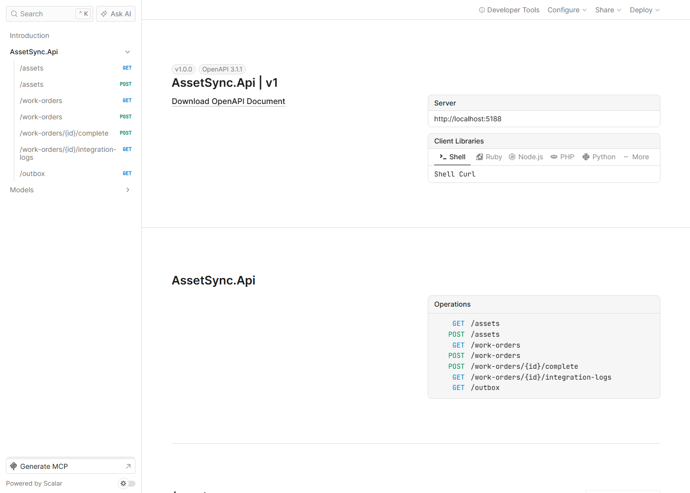
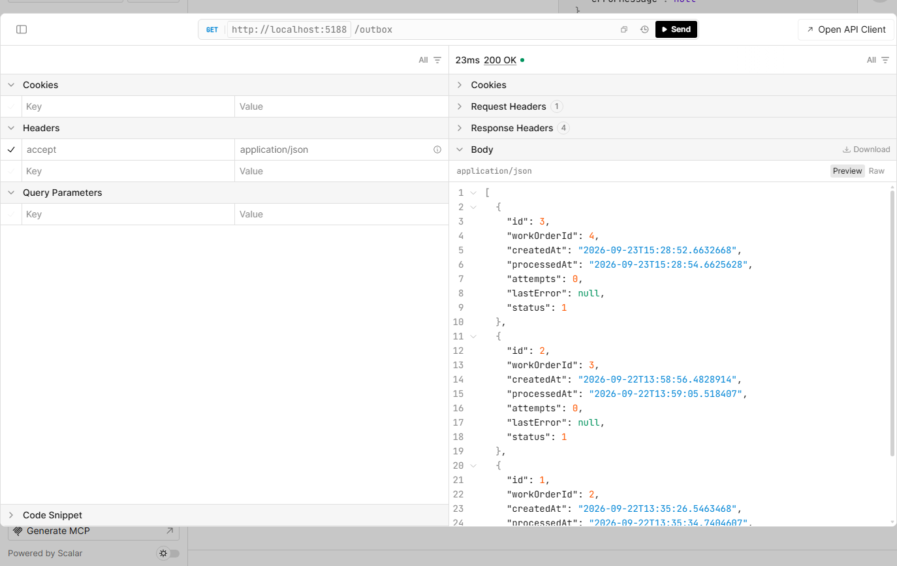
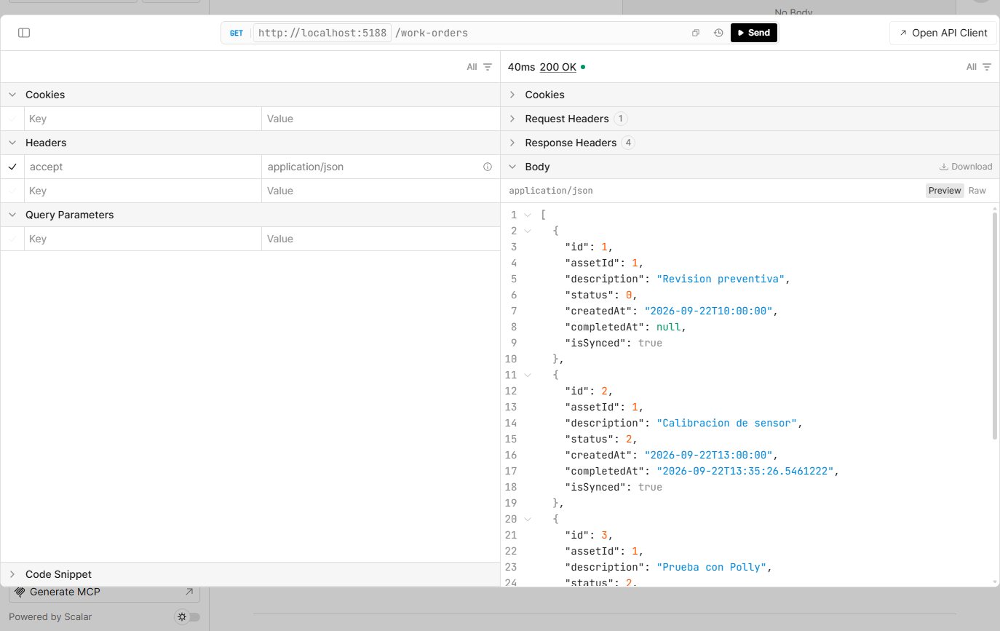

# Desarrollo local

[← Volver al README](../README.md)

Requiere [.NET 10 SDK](https://dotnet.microsoft.com/download) y una base de
datos: SQL Server (por defecto) o PostgreSQL.

## Configuración obligatoria

La autenticación JWT es obligatoria: sin clave de firma la API se niega a
arrancar. Con [User Secrets](https://learn.microsoft.com/aspnet/core/security/app-secrets):

```bash
dotnet user-secrets set "Jwt:SigningKey" "$(openssl rand -base64 48)" --project src/AssetSync.Api
dotnet user-secrets set "Auth:Clients:0:ClientId" "erp-integration" --project src/AssetSync.Api
dotnet user-secrets set "Auth:Clients:0:ClientSecret" "<un secreto largo>" --project src/AssetSync.Api
dotnet user-secrets set "Auth:Clients:0:Scopes" "workorders.write integration.read" --project src/AssetSync.Api
dotnet user-secrets set "Auth:Clients:1:ClientId" "asset-admin" --project src/AssetSync.Api
dotnet user-secrets set "Auth:Clients:1:ClientSecret" "<otro secreto largo>" --project src/AssetSync.Api
dotnet user-secrets set "Auth:Clients:1:Scopes" "assets.write" --project src/AssetSync.Api
```

## Con SQL Server

En Windows, la cadena por defecto (`appsettings.json`) apunta a LocalDB:

```bash
dotnet tool restore
dotnet ef database update --project src/AssetSync.Infrastructure --startup-project src/AssetSync.Api
dotnet run --project src/AssetSync.Api
```

LocalDB es exclusivo de Windows. En macOS o Linux, SQL Server corre en un
contenedor (en Apple Silicon, con la emulación de Rosetta activada en
Docker), expuesto solo en `127.0.0.1`:

```bash
docker run -d --name assetsync-sql -e ACCEPT_EULA=Y -e MSSQL_PID=Developer \
  -e MSSQL_SA_PASSWORD="<contraseña fuerte>" -p 127.0.0.1:1433:1433 \
  -v assetsync-sql-data:/var/opt/mssql mcr.microsoft.com/mssql/server:2022-latest
dotnet user-secrets set "ConnectionStrings:AssetSyncDb" \
  "Server=127.0.0.1,1433;Database=AssetSyncDb;User Id=sa;Password=<contraseña>;TrustServerCertificate=True" \
  --project src/AssetSync.Api
```

## Con PostgreSQL

El motor se elige con `Database:Provider` (`SqlServer` por defecto o
`PostgreSql`). Las migraciones de PostgreSQL viven en su propio proyecto:

```bash
docker run -d --name assetsync-postgres -e POSTGRES_PASSWORD="<contraseña>" \
  -p 127.0.0.1:5432:5432 -v assetsync-pg-data:/var/lib/postgresql/data postgres:17-alpine
dotnet user-secrets set "Database:Provider" "PostgreSql" --project src/AssetSync.Api
dotnet user-secrets set "ConnectionStrings:AssetSyncDb" \
  "Host=127.0.0.1;Port=5432;Database=assetsync;Username=postgres;Password=<contraseña>" \
  --project src/AssetSync.Api
dotnet ef database update --project src/AssetSync.Migrations.PostgreSql --startup-project src/AssetSync.Api
```

## Panel web

El panel de operación vive en `src/AssetSync.Web` (React, TypeScript, Vite y
TanStack Query) y requiere [Node.js](https://nodejs.org) 20.19 o superior. En
desarrollo, Vite reenvía las llamadas de `/api` a la API local en el puerto
5188, así que no hace falta configurar CORS:

```bash
cd src/AssetSync.Web
npm install
npm run dev   # http://localhost:5173
```

Las listas de órdenes se actualizan cada 5 segundos: al completar una orden
se ve pasar de "En cola" a "Sincronizada" sin recargar. Para publicarlo en
otro dominio, la dirección de la API se define al compilar con
`VITE_API_BASE_URL`, y ese dominio se agrega a `Cors:AllowedOrigins` en la
API.

## RabbitMQ (opcional)

Sin configurar, la API corre igual: `messaging` aparece `Degraded` en
`/health`. Para probarlo:

```bash
dotnet user-secrets set "RabbitMq:ConnectionString" "<tu AMQP URL>" --project src/AssetSync.Api
```

## Docker

```bash
docker build -t assetsync-api .
docker run -p 8080:8080 \
  -e ConnectionStrings__AssetSyncDb="<tu cadena de conexión>" \
  -e RabbitMq__ConnectionString="<tu AMQP URL>" \
  -e Jwt__SigningKey="<clave de 32+ bytes>" \
  -e Auth__Clients__0__ClientId="erp-integration" -e Auth__Clients__0__ClientSecret="<secreto>" \
  -e Auth__Clients__0__Scopes="workorders.write integration.read" \
  assetsync-api
```

LocalDB no corre dentro de un contenedor Linux, así que hay que apuntar
`ConnectionStrings__AssetSyncDb` a una base real (local, en otro contenedor o
en la nube); para PostgreSQL, agrega `-e Database__Provider=PostgreSql`. El
Dockerfile se construye y se valida en cada push mediante GitHub Actions.

## Interfaz visual (Scalar)

En desarrollo, `/scalar/v1` sirve una interfaz visual (generada desde
`/openapi/v1.json`) para explorar y probar cada endpoint sin Postman ni curl.
Capturas reales de un ciclo completo: se crea una orden, se completa, y
segundos después el `OutboxProcessor` ya la sincronizó.

| Interfaz visual (Scalar) | Outbox después de sincronizar |
|---|---|
|  |  |


